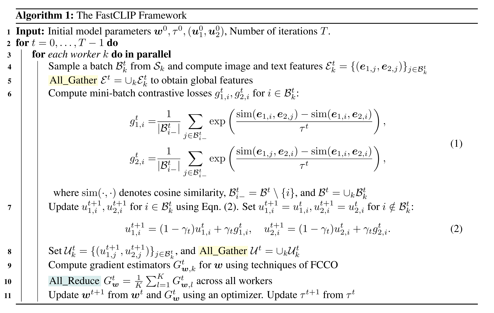
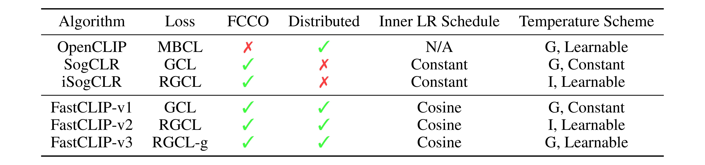
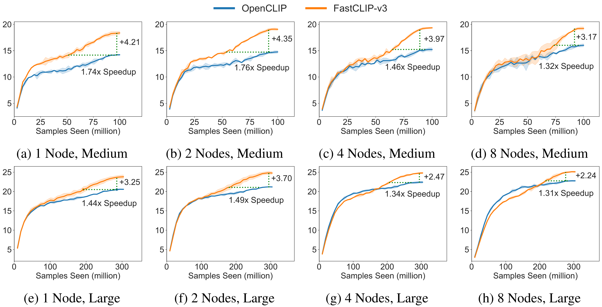
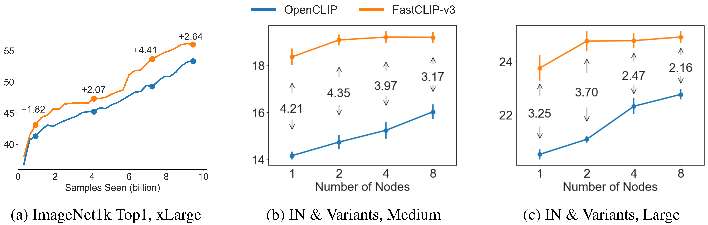
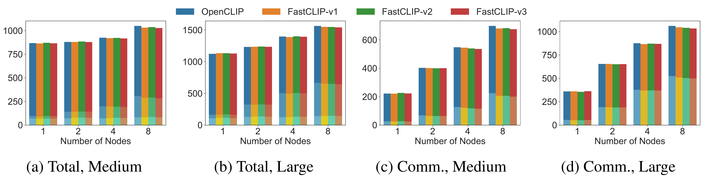

<h1 align="center">FastCLIP: A Suite of Optimization Techniques to <br> Accelerate CLIP Training with Limited Resources</h1>

**TL;DR**: We explore several aspects of CLIP training with *limited resources* (e.g., up to tens of GPUs). First, we introduce FastCLIP, a general CLIP training framework built on advanced compositional optimization techniques while designed and optimized for the **distributed setting**. Second, to further boost training efficiency, we investigate three components of the framework from an optimization perspective: the schedule of the inner learning rate, the update rules of the temperature parameter and the model parameters, respectively. Finally, we benchmark the performance of FastCLIP and OpenCLIP on different compute scales (up to 32 GPUs on 8 nodes), and three data scales (CC3M, CC12M and LAION400M).

**Table of Contents**
- [Introduction](#introduction)
    - [The Proposed FastCLIP Framework](#the-proposed-fastclip-framework)
    - [Experiment Results](#experiment-results)
- [Getting Started](#getting-started)
    - [Environment Setup](#environment-setup)
    - [Training](#training)
    - [Evaluation](#evaluation)

## Introduction

### The Proposed FastCLIP Framework

The FastCLIP framework is a general CLIP training framework. It includes 4 algorithms which we name FastCLIP-v0 to FastCLIP-v3. The pseudo-code of FastCLIP is presented below.

<p align="center"></p>

FastCLIP-v0 to FastCLIP-v3 mainly differ in loss computation and temperature update (Line 9 and Line 11). Specifically, FastCLIP-v0 and FastCLIP-v1 optimizes the Global Contrastive Loss (GCL), which is first used by SogCLR:

<p align="center"></p>

The difference between v0 and v1 is that in v0 the temperature parameter $\tau$ is learnable and is updated using gradient method, while in v1 the temperature parameter is set to a constant. FastCLIP-v2 optimizes the Robust Global Contrastive Loss (RGCL), which is first used by iSogCLR:

<p align="center"></p>

where $\tau_1 =(\tau_{1,1}, \ldots, \tau_{1, n})$, $\tau_2 =(\tau_{2,1}, \ldots, \tau_{2, n})$, $\tau_0$ is a small value,  $\rho\geq 0$ is a hyperparameter. In FastCLIP-v2, the temperature parameter is also learnable. FastCLIP-v3 optimizes a variant of RGCL which we name RGCL with global temperature (RGCL-g):

<p align="center"></p>

The main difference between RGCL and RGCL-g is that RGCL-g unifies the individual temperature parameter in RGCL into a single global temperature. In FastCLIP-v3, the temperature parameter is also learnable. In the following table we provide comparison between different algorithms.

<p align="center"></p>

Note that OpenCLIP uses the Mini-Batch Contrastive Loss which we omit here for brevity. FCCO denotes finite-sum coupled compositional optimization. Inner LR Schedule denotes the schedule for $\gamma_t$ in Eqn. (2) in Algorithm 1. In Temperature Scheme, G means global temperature while I means individual temperature.

### Experiment Results

Here we only present part of the results of OpenCLIP vs. FastCLIP-v3. For more results please refer to our paper. The following figure is the average of ImageNet and its variants curves in the medium-scale (CC3M, batch size 1024) and large-scale (CC12M, batch size 2048) settings. From the results we can see that FastCLIP-v3 has a significant improvement and speedup over OpenCLIP.

<p align="center"></p>

In the following figure, (a) and (b) are the average of ImageNet and its variants across different number of nodes in the medium-scale and large-scale settings, respectively. while (c) is the ImageNet Top1 accuracy in the xlarge-scale setting (LAION400M, batch size 5120). From the results we can see that FastCLIP-v3 outperforms OpenCLIP by a large margin. Moreover, from (a) and (b) we observe that the performance of FastCLIP-v3 plateaus at 2 nodes, which verifies that FastCLIP does not require a large amount of computing resources.

<p align="center"></p>

The following figure shows the training time in the medium-scale and large-scale settings. Subfigures (a) and (b) plot the per-iteration training time. Subfigures (c) and (d) plot the communication time per iteration. We can see that FastCLIP has a shorter per-iteration time due to shorter communication time, which demonstrates the effectiveness of our efficient gradient computation/communication strategy.

<p align="center"></p>

## Getting Started

### Environment Setup

To set up the environment for training, please
1. Download this repository:
    ```bash
    git clone https://github.com/Optimization-AI/fast_clip.git
    cd fast_clip
    ```
2. Create a new environment:
    ```bash
    conda create -n fastclip python=3.11
    conda activate fastclip
    pip install -r requirements-training.txt
    ```

### Training

We present sample scripts to run OpenCLIP and FastCLIP-v0 to v3 using slurm. For non-slurm instructions, please refer to the end of this subsection. The following is a sample slurm script to run **FastCLIP-v3** on cc3m using 2 nodes and 4 GPUs per node.
```bash
#!/bin/bash -x
#SBATCH --time=2-00:00:00
#SBATCH --mem=120G
#SBATCH --nodes=2
#SBATCH --gres=gpu:4
#SBATCH --ntasks-per-node=4
#SBATCH --cpus-per-task=6
#SBATCH --wait-all-nodes=1
#SBATCH --job-name=fastclipv3
#SBATCH --partition=gpu
#SBATCH --output=%x_%j.log

source ~/.bashrc
conda activate fastclip

master_addr=$(scontrol show hostnames "$SLURM_JOB_NODELIST" | head -n 1)
export MASTER_ADDR=$master_addr
export MASTER_PORT=12805

export CUDA_VISIBLE_DEVICES='0,1,2,3'
export PYTHONPATH="$PYTHONPATH:$PWD/src"
export HUGGINGFACE_HUB_CACHE='./checkpoints/huggingface'

srun python -u src/training/main.py \
    --save-frequency 1 \
    --train-data './datasets/cc3m_webdataset/cc3m_train/{00000..00331}.tar' \
    --train-num-samples 2723840 --data_size 3318333 \
    --warmup 10000 \
    --batch-size 256 \
    --epochs 37 \
    --workers 6 \
    --model RN50 \
    --name medium_fastclipv3 \
    --seed 2024 \
    --profile \
    --wd 0.1 \
    --local-loss \
    --fastclip --multiply_tau --temperature_scheme global_learnable \
    --lr 1e-3 --lr_tau 2e-4 --lr_tau_scheduler step_thresh --rho 6.5 \
    --gamma 0.2 --gamma_schedule cosine --gamma_decay_epochs 18
```

To run **OpenCLIP**, replace the `srun python -u src/training/main.py` command with
```bash
srun python -u src/training/main.py \
    --save-frequency 1 \
    --train-data './datasets/cc3m_webdataset/cc3m_train/{00000..00331}.tar' \
    --train-num-samples 2723840 --data_size 3318333 \
    --warmup 10000 \
    --batch-size 256 \
    --epochs 37 \
    --workers 6 \
    --model RN50 \
    --name medium_openclip \
    --seed 2024 \
    --profile \
    --wd 0.1 \
    --local-loss \
    --gather-with-grad \
    --lr 1e-3
```

To run **FastCLIP-v0**, replace the `srun python -u src/training/main.py` command with
```bash
srun python -u src/training/main.py \
    --save-frequency 1 \
    --train-data './datasets/cc3m_webdataset/cc3m_train/{00000..00331}.tar' \
    --train-num-samples 2723840 --data_size 3318333 \
    --warmup 10000 \
    --batch-size 256 \
    --epochs 37 \
    --workers 6 \
    --model RN50 \
    --name medium_fastclipv0 \
    --seed 2024 \
    --profile \
    --wd 0.1 \
    --local-loss \
    --fastclip --temperature_scheme global_learnable \
    --lr 1e-3 \
    --gamma 0.2 --gamma_schedule cosine --gamma_decay_epochs 18
```

To run **FastCLIP-v1**, replace the `srun python -u src/training/main.py` command with
```bash
srun python -u src/training/main.py \
    --save-frequency 1 \
    --train-data './datasets/cc3m_webdataset/cc3m_train/{00000..00331}.tar' \
    --train-num-samples 2723840 --data_size 3318333 \
    --warmup 10000 \
    --batch-size 256 \
    --epochs 37 \
    --workers 6 \
    --model RN50 \
    --name medium_fastclipv1 \
    --seed 2024 \
    --profile \
    --wd 0.1 \
    --local-loss \
    --fastclip --temperature_scheme global_constant \
    --lr 1e-3 \
    --gamma 0.2 --gamma_schedule cosine --gamma_decay_epochs 18
```

To run **FastCLIP-v2**, replace the `srun python -u src/training/main.py` command with
```bash
srun python -u src/training/main.py \
    --save-frequency 1 \
    --train-data './datasets/cc3m_webdataset/cc3m_train/{00000..00331}.tar' \
    --train-num-samples 2723840 --data_size 3318333 \
    --warmup 10000 \
    --batch-size 256 \
    --epochs 37 \
    --workers 6 \
    --model RN50 \
    --name medium_fastclipv2 \
    --seed 2024 \
    --profile \
    --wd 0.1 \
    --local-loss \
    --fastclip --temperature_scheme individual_learnable \
    --lr 1e-3 --lr_tau 0.0133 --lr_tau_scheduler const --temperature 0.03 --rho 7.0 \
    --gamma 0.2 --gamma_schedule cosine --gamma_decay_epochs 18
```
**Non-slurm Training**: For non-slurm training, please set `master_addr` manually (e.g., `127.0.0.1`), change `srun python -u src/training/main.py` to `cd src && torchrun --nproc_per_node=4 --rdzv_endpoint=$master_addr -m training.main`, and run the above script with `/bin/bash`.

### Evaluation

**ImageNet-1k**: The following is a sample slurm script to evaluate a trained CLIP model (specified by `--resume`) on ImageNet-1k.
```bash
#!/bin/bash -x
#SBATCH --time=01:00:00
#SBATCH --mem=20G
#SBATCH --nodes=1
#SBATCH --gres=gpu:1
#SBATCH --ntasks-per-node=1
#SBATCH --cpus-per-task=6
#SBATCH --job-name=eval_fastclip
#SBATCH --partition=gpu
#SBATCH --output=%x_%j.log

source ~/.bashrc
conda activate fastclip

master_addr=$(scontrol show hostnames "$SLURM_JOB_NODELIST" | head -n 1)
export MASTER_ADDR=$master_addr
export MASTER_PORT=12802

export PYTHONPATH="$PYTHONPATH:$PWD/src"
export HUGGINGFACE_HUB_CACHE='./checkpoints/huggingface'

srun python -u src/training/main.py \
    --resume ./logs/medium_fastclipv3/checkpoints/epoch_37.pt \
    --zeroshot-frequency 1 \
    --imagenet-val ./datasets/imagenet/val \
    --batch-size 512 \
    --epochs 0 \
    --workers 6 \
    --model RN50 \
    --name eval_medium_fastclipv3_epoch_37 \
    --seed 2024
```
**Datacomp**: For evaluation on the Datacomp benchmark, please refer to the "Evaluation" section in the [Datacomp repository](https://github.com/mlfoundations/datacomp?tab=readme-ov-file#evaluation).

**Non-slurm Training**: For non-slurm training, please set `master_addr` manually (e.g., `127.0.0.1`), change `srun python -u src/training/main.py` to `python src/training/main.py`, and run the above script with `/bin/bash`.
