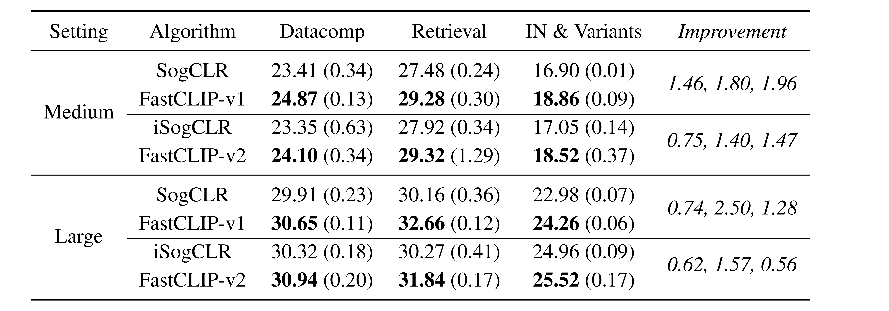

<h1 align="center">FastCLIP: A Suite of Optimization Techniques to <br> Accelerate CLIP Training with Limited Resources</h1>

Paper link: [arXiv](https://arxiv.org/abs/2407.01445)

We explore several aspects of CLIP training with *limited resources* (e.g., up to tens of GPUs). First, we introduce FastCLIP, a general CLIP training framework built on advanced compositional optimization techniques while designed and optimized for the **distributed setting**. Second, to further boost training efficiency, we investigate three components of the framework from an optimization perspective: the schedule of the inner learning rate, the update rules of the temperature parameter and the model parameters, respectively. Finally, we benchmark the performance of FastCLIP and OpenCLIP on different compute scales (up to 32 GPUs on 8 nodes), and three data scales (CC3M, CC12M and LAION400M).

**Table of Contents**
- [Introduction](#introduction)
    - [The Proposed FastCLIP Framework](#the-proposed-fastclip-framework)
    - [Experiment Results](#experiment-results)
    - [References](#references)
- [Getting Started](#getting-started)
    - [Environment Setup](#environment-setup)
    - [Training](#training)
    - [Evaluation](#evaluation)
- [Citing FastCLIP](#citing-fastclip)

## Introduction

### The Proposed FastCLIP Framework

The FastCLIP framework is an efficient distributed training framework of CLIP models, which includes a family of algorithms differing in loss computation and temperature parameter update. It is powered by advanced finite-sum coupled compositional optimization (FCCO) [[4]](#references) techniques for optimizing global contrastive losses, which is suitable for training CLIP models with limited compute resources.  Below we introduce three algorithms in this framework which are named FastCLIP-v1 to v3. We first present the pseudo-code of FastCLIP:

<p align="center"></p>

The three algorithms have different ways of computing the loss and updating the temperature $\tau$ (Line 9 and Line 11 in Algorithm 1). Specifically, **FastCLIP-v1** optimizes the Global Contrastive Loss (GCL), which is first used by SogCLR [[1]](#references):

<p align="center"></p>

For $\tau$ update, FastCLIP-v1 sets it to a constant, as in SogCLR. FastCLIP-v1 differs from SogCLR in the schedule of the inner learning rate $\gamma$ in Eqn. (2): SogCLR sets $\gamma_t$ to a constant, while FastCLIP-v1 updates it using a cosine decay schedule: Let $E_{\mathrm{cur}}$ denote the current epoch, and $E$ denote the number of decay epochs, then $\gamma_t$ is set to:

<p align="center"></p>

**FastCLIP-v2** optimizes the Robust Global Contrastive Loss (RGCL), which is first used by iSogCLR [[2]](#references). In RGCL, the temperature parameter becomes a variable that needs to be optimized. Also, each data point now has its individual temperature parameter, as opposed to the global temperature in GCL. Let $\tau_1 =(\tau_{1,1}, \ldots, \tau_{1, n})$, $\tau_2 =(\tau_{2,1}, \ldots, \tau_{2, n})$, then RGCL is defined as:

<p align="center"></p>

where $\tau_0$ is a small value, $\rho\geq 0$ is a hyperparameter. Similarly, the difference between FastCLIP-v2 and iSogCLR lies in the schedule of the inner learning rate $\gamma$, where the former leverages the cosine schedule and the latter uses the constant schedule. **FastCLIP-v3** optimizes a variant of RGCL which we name RGCL with global temperature (RGCL-g):

<p align="center"></p>

The main difference between RGCL and RGCL-g is that RGCL-g unifies the individual temperature parameter into a single global temperature. In FastCLIP-v3, the temperature parameter is also learnable. In the following table we provide comparison between different algorithms.

<p align="center"></p>

Note that OpenCLIP [[3]](#references) uses the Mini-Batch Contrastive Loss (MBCL), which requires a large batch size for good performance. "FCCO" means the algorithm leverages finite-sum coupled compositional optimization techniques. "Distributed" means the algorithm is designed for distributed training. In "Temperature Scheme", "G" means global temperature while "I" means individual temperature.

### Experiment Results

Next we present the results of FastCLIP vs. OpenCLIP, SogCLR and iSogCLR. For more results please refer to our paper. The following table shows the results of FastCLIP-v1 (FastCLIP-v2, resp.) vs. SogCLR (iSogCLR, resp.) in the medium-scale (**CC3M**, batch size 1024) and large-scale (**CC12M**, batch size 2048) settings.

<p align="center"></p>

The following figure presents the average of **ImageNet and variants** curves of OpenCLIP and FastCLIP-v3 in the medium-scale and large-scale settings.

<p align="center"></p>

In the following figure, (a) and (b) are the average of **ImageNet and variants** of OpenCLIP and FastCLIP-v3 across different number of nodes in the medium-scale and large-scale settings, respectively. while (c) is the **ImageNet Top1** accuracy in the xlarge-scale setting (**LAION400M**, batch size 5120).

<p align="center"></p>

The following figure shows the **training time** in the medium-scale and large-scale settings. Subfigures (a) and (b) plot the per-iteration training time. Subfigures (c) and (d) plot the communication time per iteration.

<p align="center"></p>

### References

[1] Zhuoning Yuan, Yuexin Wu, Zi-Hao Qiu, Xianzhi Du, Lijun Zhang, Denny Zhou, and Tianbao Yang. Provable stochastic optimization for global contrastive learning: Small batch does not harm performance. In *Proceedings of the 39th International Conference on Machine Learning*, volume 162 of *Proceedings of Machine Learning Research*, pages 25760–25782. PMLR, 17–23 Jul 2022. URL https://proceedings.mlr.press/v162/yuan22b.html.

[2] Zi-Hao Qiu, Quanqi Hu, Zhuoning Yuan, Denny Zhou, Lijun Zhang, and Tianbao Yang. Not all semantics are created equal: Contrastive self-supervised learning with automatic temperature individualization. In *Proceedings of the 40th International Conference on Machine Learning*, volume 202 of *Proceedings of Machine Learning Research*, pages 28389–28421. PMLR, 23–29 Jul 2023. URL https://proceedings.mlr.press/v202/qiu23a.html.

[3] Gabriel Ilharco, Mitchell Wortsman, Ross Wightman, Cade Gordon, Nicholas Carlini, Rohan Taori, Achal Dave, Vaishaal Shankar, Hongseok Namkoong, John Miller, Hannaneh Hajishirzi, Ali Farhadi, and Ludwig Schmidt. Openclip. https://doi.org/10.5281/zenodo.5143773, July 2021. URL https://doi.org/10.5281/zenodo.5143773.

[4] Bokun Wang and Tianbao Yang. Finite-sum coupled compositional stochastic optimization: Theory and applications. In *Proceedings of the 39th International Conference on Machine Learning*, volume 162 of *Proceedings of Machine Learning Research*, pages 23292–23317. PMLR, 17–23 Jul 2022. URL https://proceedings.mlr.press/v162/wang22ak.html.

## Getting Started

### Environment Setup

To set up the environment for training, please
1. Download this repository:
    ```bash
    git clone https://github.com/Optimization-AI/fast_clip.git
    cd fast_clip
    ```
2. Create a new environment:
    ```bash
    conda create -n fastclip python=3.11
    conda activate fastclip
    pip install -r requirements-training.txt
    ```

### Training

We present sample slurm scripts to run OpenCLIP and FastCLIP-v0 to v3. For non-slurm instructions, please refer to the end of this subsection. To train on your own data, you need to modify the following options

- `--train-data`: the path to the training data, currently only **webdataset** format is supported.
- `--train-num-samples`: this many samples will be seen for one epoch, we recommend to set it to the actual size of the dataset.
- `--data_size`: the original size of the dataset, this may take a value different from `--train-num-samples`. In the case of CC3M, its metadata contains 3318333 image-URL/caption pairs, but we were only able to down 2723840 of them. So we set `--data_size` to 3318333 and set `--train-num-samples` to 2723848.
- `--epochs`: for this many epochs the model will be trained.
- `--gamma_decay_epochs`: for this many epochs $\gamma$ will decrease from 1.0 to `--gamma`. We recommend to set it to half of `--epochs`.

<details open>
    <summary>Sample script to run <b>FastCLIP-v3</b> on cc3m using 8 GPUs (2 nodes and 4 GPUs per node)</summary>

```bash
#!/bin/bash
#SBATCH --time=2-00:00:00
#SBATCH --mem=120G
#SBATCH --nodes=2
#SBATCH --gres=gpu:4
#SBATCH --ntasks-per-node=4
#SBATCH --cpus-per-task=6
#SBATCH --wait-all-nodes=1
#SBATCH --job-name=fastclipv3
#SBATCH --partition=gpu
#SBATCH --output=%x_%j.log

source ~/.bashrc
conda activate fastclip

master_addr=$(scontrol show hostnames "$SLURM_JOB_NODELIST" | head -n 1)
export MASTER_ADDR=$master_addr
export MASTER_PORT=12805

export CUDA_VISIBLE_DEVICES='0,1,2,3'
export PYTHONPATH="$PYTHONPATH:$PWD/src"
export HUGGINGFACE_HUB_CACHE='./checkpoints/huggingface'

srun python -u src/training/main.py \
    --save-frequency 1 \
    --train-data './datasets/cc3m_webdataset/cc3m_train/{00000..00331}.tar' \
    --train-num-samples 2723840 --data_size 3318333 \
    --warmup 10000 \
    --batch-size 128 \
    --epochs 37 \
    --workers 6 \
    --model RN50 \
    --name medium_fastclipv3 \
    --seed 2024 \
    --profile \
    --wd 0.1 \
    --local-loss \
    --fastclip --multiply_tau --temperature_scheme global_learnable \
    --lr 1e-3 --lr_tau 2e-4 --lr_tau_scheduler step_thresh --rho 6.5 \
    --gamma 0.2 --gamma_schedule cosine --gamma_decay_epochs 18
```

</details>

<details>
    <summary>Sample script to run <b>OpenCLIP</b> on cc3m using 8 GPUs (click to expand):</summary>

Replace the `srun python -u src/training/main.py` command in the FastCLIP-v3 script with
```bash
srun python -u src/training/main.py \
    --save-frequency 1 \
    --train-data './datasets/cc3m_webdataset/cc3m_train/{00000..00331}.tar' \
    --train-num-samples 2723840 --data_size 3318333 \
    --warmup 10000 \
    --batch-size 128 \
    --epochs 37 \
    --workers 6 \
    --model RN50 \
    --name medium_openclip \
    --seed 2024 \
    --profile \
    --wd 0.1 \
    --local-loss \
    --gather-with-grad \
    --lr 1e-3
```

</details>

<details>
    <summary>Sample script to run <b>FastCLIP-v0</b> on cc3m using 8 GPUs (click to expand):</summary>

Replace the `srun python -u src/training/main.py` command in the FastCLIP-v3 script with
```bash
srun python -u src/training/main.py \
    --save-frequency 1 \
    --train-data './datasets/cc3m_webdataset/cc3m_train/{00000..00331}.tar' \
    --train-num-samples 2723840 --data_size 3318333 \
    --warmup 10000 \
    --batch-size 128 \
    --epochs 37 \
    --workers 6 \
    --model RN50 \
    --name medium_fastclipv0 \
    --seed 2024 \
    --profile \
    --wd 0.1 \
    --local-loss \
    --fastclip --temperature_scheme global_learnable \
    --lr 1e-3 \
    --gamma 0.2 --gamma_schedule cosine --gamma_decay_epochs 18
```

</details>

<details>
    <summary>Sample script to run <b>FastCLIP-v1</b> on cc3m using 8 GPUs (click to expand):</summary>

Replace the `srun python -u src/training/main.py` command in the FastCLIP-v3 script with
```bash
srun python -u src/training/main.py \
    --save-frequency 1 \
    --train-data './datasets/cc3m_webdataset/cc3m_train/{00000..00331}.tar' \
    --train-num-samples 2723840 --data_size 3318333 \
    --warmup 10000 \
    --batch-size 128 \
    --epochs 37 \
    --workers 6 \
    --model RN50 \
    --name medium_fastclipv1 \
    --seed 2024 \
    --profile \
    --wd 0.1 \
    --local-loss \
    --fastclip --temperature_scheme global_constant \
    --lr 1e-3 \
    --gamma 0.2 --gamma_schedule cosine --gamma_decay_epochs 18
```

</details>

<details>
    <summary>Sample script to run <b>FastCLIP-v2</b> on cc3m using 8 GPUs (click to expand):</summary>

Replace the `srun python -u src/training/main.py` command in the FastCLIP-v3 script with
```bash
srun python -u src/training/main.py \
    --save-frequency 1 \
    --train-data './datasets/cc3m_webdataset/cc3m_train/{00000..00331}.tar' \
    --train-num-samples 2723840 --data_size 3318333 \
    --warmup 10000 \
    --batch-size 128 \
    --epochs 37 \
    --workers 6 \
    --model RN50 \
    --name medium_fastclipv2 \
    --seed 2024 \
    --profile \
    --wd 0.1 \
    --local-loss \
    --fastclip --temperature_scheme individual_learnable \
    --lr 1e-3 --lr_tau 0.0133 --lr_tau_scheduler const --temperature 0.03 --rho 7.0 \
    --gamma 0.2 --gamma_schedule cosine --gamma_decay_epochs 18
```

</details>

<details>
    <summary>Sample script to run <b>FastCLIP-v3</b> on <b>cc12m</b> using 8 GPUs (click to expand):</summary>

Replace the `srun python -u src/training/main.py` command in the cc3m script with
```bash
srun python -u src/training/main.py \
    --save-frequency 1 \
    --train-data './datasets/cc12m_webdataset/cc12m/{00000..01242}.tar' \
    --train-num-samples 9187328 --data_size 12423374 \
    --warmup 10000 \
    --batch-size 256 \
    --epochs 33 \
    --workers 6 \
    --model ViT-B-32 \
    --name large_fastclipv3 \
    --seed 2024 \
    --profile \
    --wd 0.1 \
    --local-loss \
    --fastclip --multiply_tau --temperature_scheme global_learnable \
    --lr 4e-4 --lr_tau 1e-4 --lr_tau_scheduler step_thresh --rho 8.5 \
    --gamma 0.2 --gamma_schedule cosine --gamma_decay_epochs 16
```

</details>

**Non-slurm Training**: For non-slurm training, please set `master_addr` manually (e.g., `127.0.0.1`), change `srun python -u src/training/main.py` to `cd src && torchrun --nproc_per_node=4 --rdzv_endpoint=$master_addr -m training.main`, and run the above script with `/bin/bash`.

### Evaluation

<details open>
    <summary>Sample slurm script to evaluate a trained CLIP model (specified by <code>--resume</code>) on <b>ImageNet-1k</b>:</summary>

```bash
#!/bin/bash
#SBATCH --time=01:00:00
#SBATCH --mem=20G
#SBATCH --nodes=1
#SBATCH --gres=gpu:1
#SBATCH --ntasks-per-node=1
#SBATCH --cpus-per-task=6
#SBATCH --job-name=eval_fastclip
#SBATCH --partition=gpu
#SBATCH --output=%x_%j.log

source ~/.bashrc
conda activate fastclip

master_addr=$(scontrol show hostnames "$SLURM_JOB_NODELIST" | head -n 1)
export MASTER_ADDR=$master_addr
export MASTER_PORT=12802

export PYTHONPATH="$PYTHONPATH:$PWD/src"
export HUGGINGFACE_HUB_CACHE='./checkpoints/huggingface'

srun python -u src/training/main.py \
    --resume ./logs/medium_fastclipv3/checkpoints/epoch_37.pt \
    --zeroshot-frequency 1 \
    --imagenet-val ./datasets/imagenet/val \
    --batch-size 512 \
    --epochs 0 \
    --workers 6 \
    --model RN50 \
    --name eval_medium_fastclipv3_epoch_37 \
    --seed 2024
```

</details>

**Datacomp**: For evaluation on the Datacomp benchmark, please refer to the "Evaluation" section in the [Datacomp repository](https://github.com/mlfoundations/datacomp?tab=readme-ov-file#evaluation).

**Non-slurm Training**: For non-slurm training, please set `master_addr` manually (e.g., `127.0.0.1`), change `srun python -u src/training/main.py` to `python src/training/main.py`, and run the above script with `/bin/bash`.

## Citing FastCLIP

If you find FastCLIP useful in your research, please consider citing the following paper:
```bibtex
@article{wei2024fastclip,
  title={FastCLIP: A Suite of Optimization Techniques to Accelerate CLIP Training with Limited Resources},
  author={Wei, Xiyuan and Ye, Fanjiang and Yonay, Ori and Chen, Xingyu and Sun, Baixi and Tao, Dingwen and Yang, Tianbao},
  journal={arXiv preprint arXiv:2407.01445},
  year={2024}
}
```
